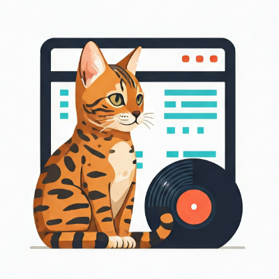

# Discogs-CTL

<div align="left">
    
    <div style="display: inline-block;">
    <p>
	    <em>A command line tool for Discogs users to compare their own store with another user's wantlist.</em>
    </p>
    <p>
        
        
        
        
    </p>
        <p><!-- default option, no dependency badges. -->
</p>
        <p>
	<!-- default option, no dependency badges. -->
</p>
    </div>
</div>
<br clear="left"/>

##  Motivation

I want to know whether someone is looking for a record in their wantlist that I offer in my store or that I have twice in my collection.
Wantlists can contain several hundred records and go over several pages, so it is very tedious to compare them manually and work through them page by page.
The tool shows me which record I offer that are contained in another user's wantlist.

##  Demo


##  Installation

Install `discogs-ctl` using one of the following methods:

**Build from source:**

Before getting started with discogs-ctl, ensure your runtime environment meets the following requirements:

- **Programming Language:** Kotlin
- **Package Manager:** Gradle

1. Clone the discogs-ctl repository:
```sh
git clone https://github.com/ezienecker/discogs-ctl
```

2. Navigate to the project directory:
```sh
cd discogs-ctl
```

3. Install the project dependencies:
```sh
gradle build
```

##  Usage

To run the project using `runsample`, execute the following command:

```sh
./runsample discogs-ctl wantlist --username Madlip89
```

Or you can run the project without re-building it using the following command:

```sh
./runsample-without-build discogs-ctl shop --username Madlip89
```

**Configure defaults:**

To configure the default username, run the following command:

```sh
./runsample-without-build discogs-ctl config set username Madlip89
```

By default, all requests are unauthenticated. 
If you want to make authenticated requests, you can set a token via the config command. 
This is then sent in the authorization header.

In order to generate a token, you need to create a personal access token on the Discogs website.
Go to your [Developer Settings](https://www.discogs.com/settings/developers) or go to [discogs.com](https://www.discogs.com) click your user avatar on the top right of your screen, then "Settings", then "Developers" and click "Generate new token".


```sh
./runsample-without-build discogs-ctl config set token <personal_access_token>
```

**Commands**

For a full list of available commands, run the following command:

```sh
./runsample-without-build discogs-ctl --help
```

##  Support

If you found a bug or have a feature request, please open an [issue](https://github.com/ezienecker/discogs-ctl/issues)
